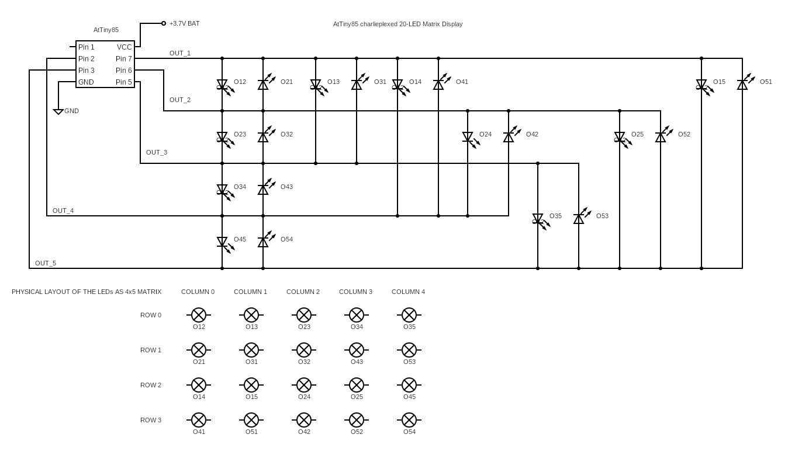

# 24015 - CONTROLLING 20 LEDs USING ATTINY85's 5 I/O PINS
---

In this project we are demonstrating how 5 I/O pins of the mighty AtTiny85 microcontroller can be used to control 20 LEDs - one by one! The method we will be using here is called **[<u>_charlieplexing_</u>][3]**. The general formula for the number of LEDs that can be controlled for any given number of MCU I/O pins is as follows:

**_Number of Controllable LEDs_ = (_Number of MCU pins_) x (_Number of pins_ -1)**

According to the above formula, since we are allocating 5 I/O pins on our microcontroller, we are able to control 5 x 4 = 20 LEDs. Simple!

Following is a working circuit we have used to demonstrate this concept. This diagram also includes the physical layout of the 20 LEDs (arranged as a 4 x 5 display matrix) that is used as reference in the AtTiny85 source code.

Even with this simple 4x5 LED matrix, there are many interesting animation patterns one can implement. Following are the functions we have implemented so far (there are many more to come so stay tuned to this repository!) to inspire you. You can access the controller code here:

**1 - <u>[basic_test()][1]:</u>** Lights up each LED in the matrix in turn.

**2 - <u>column_scan():</u>** Each LED column in the matrix moves from left to right

**3 - <u>row_scan():</u>** Each LED row in the matrix moves from top to bottom

**4 - <u>row_snake():</u>** One LED scrolls across each column and moves down one row after each full scan giving the impression of a snake moving across the LED matrix.

**5 - <u>column_snake():</u>** One LED scrolls across each row and moves right one column after each full row scan giving the impression of a snake moving across the LED matrix.

**6 - <u>column_knight_rider():</u>** Each column moves from left to right and back again.

**7 - <u>row_knight_rider():</u>** Each row moves from down and up again.

**8 - <u>random_blips():</u>** Each LED position, ON time and OFF time changes randomly giving the impression of random flashes across the LED matrix.

**9 - <u>perimeter_scan():</u>** Each LED flashes as it moves around the longest perimeter of the LED matrix.

If you build this project, please share your thoughts and suggestions with the rest of circuitapps community in the comments section of **[our YouTube video][1]**. Also, please feel free to talk about any interesting modifications you make and your experimentations, if any !

## Project Challenges
There are a few things to be careful with while building this project to make sure you get it working after the first attempt

### **Caution 1 - LED Polarities**

There are 20 LEDs and you need to make sure each one is connected with the right polarity as per the circuit diagram shared above.

### **Caution 2 - Power supply voltage**

This circuit has been designed and tested using 3.7V supply voltage. Higher DC voltages may cause the LED patterns to function inaccurately.

## Useful tips

### **Tip 1:**
If you have not worked with ATtiny85 before and need support with the basic operation and programming of this device, have a look at this **<u>[excellent reference][2]</u>** that walks you through the entire process step by step. If you get stuck, drop us a message in the comments section of **<u>[our YouTube video][1]</u>**

GOOD LUCK & ENJOY EXPERIMENTING WITH CHARLIEPLEXING !

[1]: https://youtube.com/shorts/hPwn7cKLCwc

[2]: https://circuitdigest.com/microcontroller-projects/programming-attiny85-microcontroller-ic-using-arduino 

[3]: https://forum.digikey.com/t/what-is-charlieplexing-and-what-can-i-do-with-it/5963